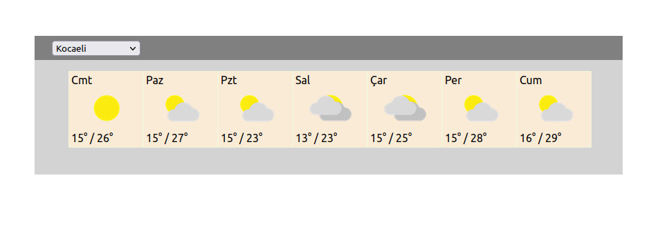

# Türkiye İller 7 Günlük Hava Durumu

Seçilen ilin 7 günlük tahmini hava durumunu verir.

## Kullanılan Servis

Hava durumu bilgilerini [www.weatherbit.io](https://www.weatherbit.io) üzerinden alıyoruz. 

Uygulamayı çalıştırmanız için önce **.env** dosyasını ana dizinde oluşturmanız ve sonrasında **Api Key** bilgisini **.env dosyası** eklenmesi gerekiyor.

```REACT_APP_END_POINT_API_KEY=sizin_api_key_bilginiz```

## Ekran Görüntüsü




## Patika React Dersi

Patika Frontend React dersleri için verilen ödev için tasarlanmıştır.

